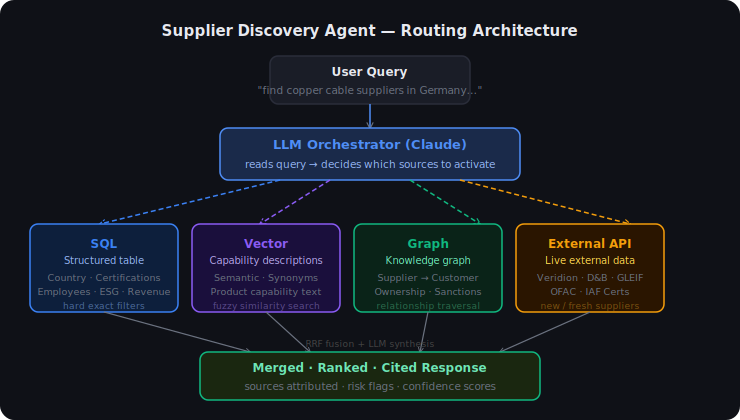

# Supplier Discovery Agent — Demo Guide

---

## The Core Problem

Procurement teams can't find suppliers efficiently because **the data they need lives in different places in different formats**:

- Supplier specs in a structured database → SQL filters
- Capability descriptions scraped from websites → semantic/vector search
- Who supplies whom, ownership chains, sanctions risk → knowledge graph
- New suppliers not yet in any internal system → live external APIs

No single retrieval engine handles all of these. And at MVP time, **you don't know which format the client's data will be in** — so locking into one approach (pure graph RAG, pure vector search, pure SQL) is premature.

**What we built:** An agent that reads the buyer's query, decides which data source(s) to activate, and routes intelligently — without assuming a fixed data topology.

---

## Architecture



> The agent picks the right engine per query. SQL for hard filters. Vector for fuzzy capability matching. Graph for relationships and risk. External API for fresh data not in the internal system.

---

## What's Actually Running vs Mocked

This matters — a founder will ask.

| Component | What runs in this demo | Production replacement |
|---|---|---|
| **Agent / orchestrator** | Claude Haiku with tool use (real LLM, real API calls) | Same — Claude or GPT-4 |
| **SQL store** | SQLite — 40 suppliers, real queries execute | PostgreSQL / Snowflake |
| **Vector store** | TF-IDF sparse vectors — real similarity search, simplified | sentence-transformers → dense 768-float embeddings → pgvector / Qdrant |
| **Knowledge graph** | NetworkX — real graph traversal, real relationship data | Neo4j / Amazon Neptune |
| **External API** | Local JSON file — simulates Veridion/D&B response format | Veridion Search API (134M+ companies), D&B Direct+ |
| **Cert validation** | Mock registry lookup | IAF / Global Accreditation Cooperation API (free) |
| **Sanctions screening** | Hardcoded flag on parent company node | OFAC SDN + Consolidated Sanctions API (free) |
| **Legal identity** | Domain + tax ID matching | GLEIF LEI REST API (free, CC0) |

**Key point:** The pipeline logic — routing, fusion, ranking, risk detection — all runs for real. The data sources are local mocks with the same schema as their production equivalents. Swapping each mock for the real API is one line.

---

## Start Here — Best Opening Query

This one query triggers **3 data sources simultaneously** and is the strongest single demonstration:

```
Find ISO 9001 certified suppliers in France that also supply aerospace companies
```

What the agent does:
1. **SQL** — filters French suppliers with ISO 9001 flag = true
2. **Graph** — traverses `SUPPLIES_TO` edges to find who has aerospace customer relationships
3. **Vector** — semantic search over capability descriptions for aerospace relevance
4. Merges all three, deduplicates, returns a cited ranked response

The source chips below the response show exactly which stores fired.

---

## Demo Prompts by Data Source

### SQL — hard structured filters
```
Find ISO 9001 certified copper cable suppliers in Germany with more than 500 employees
```
```
Show EU suppliers with ESG score above 0.8 and strong financial health
```
*What it shows:* exact filtering on structured fields — country, certification boolean, employee count. Same query that would run against a production PostgreSQL vendor master.

---

### Vector — semantic capability search
```
Find suppliers specialised in offshore wind cable systems or subsea power cables
```
```
Find high-voltage insulation cable suppliers for rail traction applications
```
*What it shows:* fuzzy matching — "subsea power cable" finds suppliers described as "offshore cable specialist" even without exact word overlap. In production this becomes sentence-transformer dense embeddings; in the demo it's TF-IDF (same idea, simpler math).

---

### Graph — relationships and risk
```
Which of our suppliers already work with Siemens or BASF?
```
```
Are any suppliers connected to sanctioned entities through ownership?
```
```
Show me the ownership structure — which suppliers share a parent company?
```
*What it shows:* traversal of `SUPPLIER → SUPPLIES_TO → CUSTOMER` and `PARENT_CO → OWNS → SUPPLIER` edges. The sanctions query finds two suppliers owned by `GlobalCopper Holdings BV` (flagged) — a risk that SQL alone would miss. In production: Neo4j Cypher queries with GLEIF + OFAC data.

---

### External API — live discovery
```
Find new emerging copper cable suppliers in Eastern Europe not in our database
```
```
Discover certified copper cable manufacturers in Ireland or Croatia
```
*What it shows:* results that don't exist in the internal database — simulating a live call to Veridion or D&B for fresh market data. In production: real API call returning 134M+ companies with evidence snippets and confidence scores.

---

### Multi-source — agent uses 2+ sources
```
Find ISO 9001 certified suppliers in France that also supply aerospace companies
```
```
Find financially healthy EU suppliers with high ESG and renewable energy cable capabilities
```
*What it shows:* the agent combining SQL (structured filters) + Graph (relationship check) + Vector (capability match) in one query. This is the differentiator — no single retrieval engine could answer this alone.

---

## The "Unknown Data Type" Answer

If the founder asks: *"what if the client's data isn't a clean table?"*

> The ingestion layer uses an LLM to detect what kind of data it receives — CSV, PDF, ERP export, scraped website — and routes it to the right store. Tabular data goes to SQL. Unstructured text goes to the vector store. Entity relationships go to the graph. The query-time routing then pulls from whichever stores have been populated. This is exactly what Scoutbee (acquired by Coupa, Oct 2025) and Veridion do — they crawl unstructured web data and structure it on ingestion.

---

## Tech Decisions — Why Each Choice

| Decision | Why |
|---|---|
| Hybrid retrieval (not just vector, not just graph) | Data topology is unknown at MVP. Design must degrade gracefully for any format. |
| RRF fusion (k=60) | Score-agnostic merge of multi-engine ranked lists. Zero tuning. Industry standard in Elasticsearch, Weaviate, Azure AI Search. From Cormack et al. SIGIR 2009. |
| TF-IDF not dense embeddings | Zero dependencies, fully offline, sufficient for demo. Same ranked-list interface — replace with sentence-transformers in 10 lines. |
| NetworkX not Neo4j | Local, no server setup. Same graph algorithms. Replace with Cypher queries in production. |
| SQLite not PostgreSQL | Zero setup. Same SQL interface. |
| Claude Haiku for orchestration | Cheap, fast, tool-use capable. The routing decisions are the intelligence — not the retrieval itself. |
| Fallback keyword router | Demo runs without any API key. Routing degrades gracefully, same sources used. |

---

## Production Path (Phased)

| Phase | What changes | What stays the same |
|---|---|---|
| **Phase 1 (now)** | Mock data, TF-IDF, NetworkX, local JSON | Pipeline structure, routing logic, agent orchestration |
| **Phase 2** | Wire OFAC + GLEIF (free). Add sentence-transformers + pgvector. License Veridion or D&B. | Everything downstream of tools.py |
| **Phase 3** | Ingest unknown data formats (LLM schema detection). Real Neo4j for graph at scale. Streaming responses. | Agent orchestration, tool interfaces |
| **Phase 4** | Learning-to-rank from buyer feedback. Human-in-the-loop for low-confidence results. RBAC + audit trail. | Core retrieval and verification architecture |

---

## Honest Limitations to Name Upfront

- **40 mock suppliers** — not real market coverage. Production Veridion has 134M+.
- **TF-IDF** — misses semantic synonyms that dense embeddings catch. Noted in the UI.
- **No streaming** — the agent runs to completion before responding. Production would stream each tool call as it fires.
- **Single-turn context** — history is passed but the agent doesn't learn preferences across sessions.
- **Cert/sanctions checks are mocked** — logic is real, data sources are not connected.

---

*Run locally: `uvicorn app.main:app --reload` → open http://127.0.0.1:8000*
*Set `ANTHROPIC_API_KEY` for real LLM orchestration (falls back to keyword router without it).*
